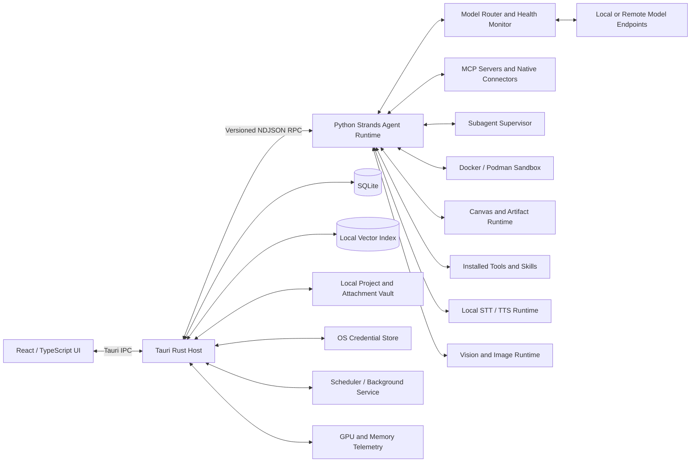

# AgentGPT Desktop
## Detailed Product and Technical Implementation Plan

**Status:** Expanded architecture and execution plan (revision 2)  
**Date:** July 19, 2026  
**Working title:** AgentGPT Desktop  
**Primary objective:** Build a premium, local-first desktop AI application that offers a ChatGPT-like experience while using local or user-configured model endpoints and Amazon's Strands Agents SDK as the primary agentic loop.

---

## 1. Executive Summary

AgentGPT Desktop will be a cross-platform desktop application for:

- Windows x64 and ARM64
- macOS Apple Silicon and Intel
- Ubuntu Linux x64 and ARM64

The application will keep conversations, project files, configuration, tool metadata, and execution history local by default. Users will be able to connect the application to any compatible model server through a configurable endpoint URL and optional API key. The application will discover available models from the server's `/v1/models` endpoint and allow the user to choose which model powers each conversation or project.

The primary user experience will resemble a polished, premium Apple-style product rather than a conventional developer tool. The window will use a custom title bar, integrated controls, rounded visual surfaces, refined typography, subtle motion, and restrained status indicators. Persistent hardware telemetry will not clutter the interface. GPU-memory or unified-memory changes will appear only as compact, color-coded toast notifications after model-related actions.

The main agentic loop will use Amazon's Strands Agents SDK. Strands will provide model invocation, streaming, tools, skills, session support, hooks, interventions, and orchestration primitives. AgentGPT will add its own product-level layers around Strands for:

- Persistent conversations and projects
- Local file and source management
- Tool and skill installation
- Dependency and model-weight accounting
- Human approval for risky actions
- Sandboxed code and file execution
- Grounding and verification
- Local speech-to-text and text-to-speech
- GPU and memory resource management
- Session RAG, project memory, and user-controlled long-term memory
- Scheduled and proactive task execution
- Connector and Model Context Protocol (MCP) integration
- Multi-agent and subagent orchestration
- Automatic model routing, health checks, and failover
- Dedicated deep-research workflows
- Native vision, image generation, and non-destructive image editing
- Canvas-based interactive artifacts
- First-class local data analysis
- Cross-platform packaging and updates

The system must not claim that hallucinations can be eliminated. Instead, it will expose evidence and confidence through a layered validation system that combines citations, schemas, deterministic checks, tests, tool-result verification, optional critic-model review, and clear UI labels such as **Verified**, **Partially verified**, and **Unverified**.

Browser control is explicitly deferred from the initial product scope. Scheduled tasks, research jobs, connectors, and subagents must therefore operate through approved tools and APIs rather than unrestricted browser automation.

---

## 2. Product Principles

### 2.1 Local-first by default

All primary application data remains on the user's machine unless the user deliberately connects to a remote model endpoint or installs a tool that communicates with an external service.

Local-first means:

- Conversations are stored locally.
- Project files and indexes are stored locally.
- API keys are stored in the operating system's secure credential store.
- Tool execution is local unless the tool manifest declares external connectivity.
- Voice processing is local when conversation mode is enabled.
- Telemetry is disabled by default or strictly opt-in.
- No cloud account is required for the initial release.

### 2.2 Powerful but permissioned

The agent should be able to inspect files, write scripts, execute tests, and modify project content, but powerful operations must be governed by explicit permissions.

Default behavior:

- Read operations inside an attached project may be allowed automatically.
- Writes are staged and summarized before application when practical.
- Destructive actions require approval.
- Network access is disabled in sandboxes unless a tool or task explicitly needs it.
- Secrets are never placed directly in model-visible prompts when a brokered credential flow is possible.

### 2.3 Premium, quiet interface

The product should feel designed rather than assembled.

The interface should:

- Avoid a default-looking Windows title bar.
- Use a custom integrated title bar and window controls.
- Use layered surfaces, subtle shadows, restrained blur, and consistent corner radii.
- Use animation sparingly to communicate state.
- Keep diagnostics hidden until needed.
- Avoid permanently visible GPU meters, token counters, or debug panels in the primary chat view.
- Provide advanced diagnostics in an optional developer panel.

### 2.4 Model-agnostic

The application must not assume a specific model vendor.

The initial model integration should support:

- OpenAI-compatible Chat Completions endpoints
- Configurable base URL
- Optional API key
- Model discovery through `GET /v1/models`
- Per-endpoint compatibility settings
- Per-model capability flags
- Local servers such as llama.cpp, vLLM, Ollama-compatible gateways where an OpenAI-compatible API is exposed

### 2.5 Proactive but user-governed

Scheduled and background work must remain transparent and revocable. The application may run recurring or condition-based tasks only after the user defines the trigger, scope, delivery behavior, tool permissions, and model budget. Every background run must have a visible history, cancellation control, and audit trail.

### 2.6 Reusable knowledge with explicit scope

RAG and memory must distinguish between conversation, project, and global scopes. The user must be able to inspect, edit, pin, export, disable, or delete stored knowledge. Imported documents and web-search results are untrusted evidence, not instructions.

### 2.7 Modular capabilities

Tools, skills, voice models, image-generation stacks, and execution runtimes should be installable modules rather than hardcoded features.

This enables:

- Smaller base installation size
- Optional heavy dependencies
- Cleaner upgrades
- Accurate disk-space reporting
- Removal of unused weights and runtimes
- A future curated marketplace

---

## 3. Recommended Architecture

### 3.1 Technology decisions

| Layer | Recommended technology | Reason |
|---|---|---|
| Desktop shell | Tauri 2 | Cross-platform desktop support, small native shell, Rust host, custom windows, lower base footprint than Electron |
| UI | React + TypeScript + Vite | Mature ecosystem, fast development, strong component model |
| UI primitives | Radix-style accessible primitives plus custom design system | Accessibility without forcing a generic visual style |
| Styling | CSS variables, design tokens, modular CSS or Tailwind used behind custom components | Consistency and fast iteration while preserving a unique appearance |
| Native host | Rust | Window management, process supervision, secure storage bridge, file operations, hardware telemetry, updates |
| Agent runtime | Python sidecar using Strands Agents SDK | Full Strands feature access and strong local-AI/tooling ecosystem |
| Host/runtime protocol | Versioned JSON-RPC over stdin/stdout with NDJSON streaming | No localhost port, simple process isolation, works across desktop platforms |
| Local database | SQLite with migrations | Reliable local persistence, portable, easy backup |
| Text search | SQLite FTS5 | Fast lexical retrieval, filtering, and local fallback |
| Local RAG | Pluggable embedding provider plus embedded vector index | Conversation-scoped ingestion, project knowledge retrieval, hybrid search, and local operation |
| Memory service | SQLite-backed scoped memory store plus retrieval tools | Separates conversation, project, and long-term user memory |
| Scheduler | Rust-hosted durable scheduler with optional tray/background service | Reliable proactive tasks, condition checks, notifications, and catch-up behavior |
| Connector layer | MCP client plus native connector adapters | Standardized external tools, resources, prompts, OAuth, and permission mediation |
| Artifact runtime | Sandboxed HTML/document/code/data preview system | Persistent Canvas, versioned artifacts, and interactive outputs |
| Secrets | Windows Credential Manager, macOS Keychain, Linux Secret Service/keyring | Avoid plaintext API keys in SQLite or config files |
| Sandbox | OCI container backend using Docker or Podman where available | Stronger isolation for arbitrary code execution, data analysis, and artifact rendering |
| Packaging | Platform-native Tauri installers plus bundled platform-specific agent runtime | Single-user install experience |

### 3.2 Why a Python sidecar is recommended

Strands supports Python and TypeScript, but the Python implementation should be treated as the primary runtime for this application because:

- The Python SDK has the broadest feature availability.
- Local speech, embeddings, document parsing, and ML tooling are heavily Python-oriented.
- Sandboxed coding tasks commonly need Python tooling.
- Tool authors are likely to contribute Python tools.
- Python enables easier integration with NVIDIA NVML, model-management libraries, and document-processing packages.

The Tauri application should not expose the Python process directly to the UI. The Rust host will launch, supervise, authenticate, and communicate with it.

### 3.3 High-level component diagram



### 3.4 Process boundaries

The application should use at least three execution boundaries:

1. **UI process**  
   Renders the application and receives sanitized state only.

2. **Trusted host process**  
   Owns secure storage, filesystem policy, process supervision, installation, updates, and hardware telemetry.

3. **Agent runtime process**  
   Runs Strands, model adapters, context assembly, tool routing, and validation logic.

Arbitrary user-generated code should run in a fourth boundary:

4. **Sandbox container or restricted subprocess**  
   Receives only an explicit workspace mount, resource budget, and capability set.

Long-running and proactive work introduces a fifth boundary:

5. **Scheduler/background worker**  
   Runs only user-authorized task definitions, has no unrestricted UI access, and invokes the same permission broker, model router, tool registry, and audit system as foreground runs.

Untrusted interactive artifacts should use a sixth boundary:

6. **Artifact preview sandbox**  
   Renders generated HTML, charts, documents, and mini-apps with a restrictive content policy and no implicit host filesystem, credential, or network access.

---

## 4. Product Information Architecture

### 4.1 Main window layout

The default desktop layout should use a three-region structure that can collapse responsively:

#### Left navigation rail

Contains:

- New conversation
- Search conversations
- Recent conversations
- Projects
- Tool and skill manager
- Scheduled tasks and activity center
- Connectors and MCP servers
- Settings
- User profile

The rail should support compact and expanded states.

#### Conversation/context sidebar

Depending on selection, this area shows:

- Project conversations
- Project source files
- Conversation branches
- Installed or referenced skills
- Active attachments
- Run history
- Project memory and indexed knowledge
- Research reports and generated artifacts
- Subagent activity

On smaller windows, this region becomes a slide-over panel.

#### Main chat workspace

Contains:

- Message timeline
- Streaming assistant output
- Tool-call cards
- Approval requests
- Evidence/citation cards
- File-change previews
- Composer
- Attachment controls
- Reference picker
- Skill picker
- Conversation-mode toggle
- Deep-research mode selector
- Canvas/artifact toggle
- Data-analysis workspace entry point

### 4.2 Custom title bar

The application window should be undecorated or use platform-specific title-bar overlay where appropriate.

Requirements:

- Integrated drag region
- Native-feeling minimize, maximize/restore, and close controls
- Platform-aware control placement
- Double-click title bar to maximize/restore
- Window shadow where supported
- Rounded application content surface
- Correct resizing hit targets
- High-DPI support
- Keyboard-accessible controls
- Fallback behavior when transparent windows or shadows are unsupported

Important implementation note: visual rounded corners and transparent-window behavior vary by operating system and compositor. The design system must degrade gracefully rather than depending on one OS-specific effect.

### 4.3 Premium design system

Create a dedicated design-token package containing:

- Typography scale
- Spacing scale
- Radius scale
- Surface elevations
- Light and dark themes
- Accent color
- Semantic colors
- Motion durations and easing
- Focus rings
- Disabled states
- Skeleton loaders
- Toast styles

Suggested visual direction:

- Neutral graphite, warm white, and restrained accent palette
- Large-radius cards for secondary surfaces
- Smaller consistent radii for buttons and controls
- Minimal borders
- Strong spacing hierarchy
- Subtle translucency only where it improves depth
- No excessive gradients or neon AI styling

### 4.4 Settings information architecture

Settings should be grouped into clear product areas:

- **Models and endpoints:** endpoint profiles, discovered models, role routing, fallback order, capability tests, and health status
- **RAG and memory:** global enable/disable defaults, embedding model, index location, retention, project sharing, long-term memory permissions, and memory review
- **Scheduled tasks:** background execution, quiet hours, notification delivery, default budgets, missed-run behavior, and run history retention
- **Connectors and MCP:** connected accounts, MCP servers, OAuth status, requested permissions, exposed tools/resources/prompts, and connection health
- **Agents:** orchestration presets, concurrency, subagent depth, role templates, and per-run budgets
- **Research:** preferred search providers, source allow/block lists, citation requirements, research depth, and automatic RAG ingestion
- **Vision and images:** vision model, image generation/editing provider, local weight management, output format, and metadata retention
- **Canvas and artifacts:** preview permissions, autosave, version retention, export defaults, and sandbox restrictions
- **Data analysis:** Python environment, approved packages, memory/CPU limits, chart defaults, and data-retention policy
- **Voice:** STT, TTS, VAD, microphone, playback, and unload behavior
- **Privacy and security:** secrets, telemetry, logs, approvals, package trust, memory controls, and data export/deletion
- **Hardware and advanced:** detected devices, resource thresholds, runtime diagnostics, and developer tools

---

## 5. Core User Flows

### 5.1 First launch

1. Display a premium welcome screen.
2. Explain local-first behavior.
3. Ask the user to configure a model endpoint.
4. Offer common local endpoint presets without requiring them.
5. Test the endpoint.
6. Fetch `/v1/models`.
7. Let the user choose a default model.
8. Optionally detect available GPU and memory capacity.
9. Offer optional installation of starter tools.
10. Open the first conversation.

### 5.2 Standard chat

1. User opens or creates a conversation.
2. User selects or inherits a model.
3. User types a message.
4. Host creates a run record.
5. Agent runtime assembles the system prompt, project instructions, conversation history, scoped memory, RAG retrieval results, active task state, and enabled skills.
6. Strands begins streaming events.
7. UI renders text, reasoning status if available, tool calls, and approvals.
8. Validation pipeline runs before or alongside final presentation.
9. Final response is stored with evidence and verification state.

### 5.3 File attachment and modification

1. User attaches a file or folder.
2. Application asks whether to:
   - Copy into the managed project vault
   - Reference the original path
   - Import a read-only snapshot
3. File metadata and content hash are recorded.
4. Parsers extract text and structure. When RAG is enabled, the source is chunked, embedded, and indexed in the conversation scope; project sources may also be indexed in the shared project scope according to project settings.
5. User asks for a modification.
6. Agent creates a proposed plan or directly acts according to permission policy.
7. Work is performed in a sandboxed working copy.
8. Tests or validation commands run.
9. UI shows a diff and validation result.
10. User approves application to the original file when required.
11. Application writes atomically and retains a recovery copy.

### 5.4 Project workflow

A project groups:

- Conversations
- Source files
- Project instructions
- Default model
- Enabled skills
- Allowed tool permissions
- Sandbox template
- Conversation RAG policy
- Shared project knowledge index
- Project memory
- Optional local search index

A conversation inside a project inherits project settings but can override them.

### 5.5 Conversation mode

1. User toggles conversation mode.
2. Application checks whether STT, TTS, and optional VAD packages are installed.
3. Missing components are offered through the tool/package manager.
4. Resource manager estimates the memory change.
5. Models load.
6. A color-coded toast displays memory before and after loading.
7. Microphone capture begins after permission approval.
8. Audio is transcribed locally.
9. Text is sent through the same Strands conversation pipeline.
10. Response text streams to the local TTS engine.
11. User can interrupt playback if barge-in is enabled.
12. Disabling conversation mode unloads voice models according to the configured retention policy.

### 5.6 Tool installation

1. User opens the tool manager.
2. User selects a tool or skill.
3. Detail page displays:
   - Description
   - Publisher
   - Version
   - Permissions
   - Supported platforms
   - Download size
   - Installed size
   - Shared dependencies
   - Model weights
   - External services
   - License
4. Installer resolves dependencies.
5. Disk-space and compatibility checks run.
6. User approves permissions and total size.
7. Files download to a staging area.
8. Checksums and signatures are verified.
9. Installation is committed atomically.
10. Resource ownership records are updated.

### 5.7 Tool removal

1. User chooses uninstall.
2. Application displays what will be removed and what will remain because another package still depends on it.
3. Tool is disabled.
4. Package files are removed.
5. Shared artifacts are removed only when their reference count reaches zero.
6. User receives a final reclaimed-space summary.

### 5.8 Session RAG ingestion and retrieval

1. User enables **RAG for this conversation** or inherits the project/global default.
2. Every uploaded file, attached source, accepted connector resource, and web-search result used by that conversation is normalized into a source record.
3. Content is chunked with stable locators, deduplicated by content hash, embedded with the configured embedding model, and stored in a conversation-scoped index.
4. Project-owned sources may also be indexed in the project knowledge index when project sharing is enabled.
5. Before later model calls, the retriever performs hybrid lexical/vector search, optional reranking, scope filtering, and evidence selection.
6. Retrieved chunks carry source IDs and locators into the prompt so citations can be validated.
7. Disabling RAG stops new embedding and semantic retrieval but does not silently delete existing indexes. The user may retain, export, rebuild, or delete them.

### 5.9 Memory creation and retrieval

1. The runtime identifies a possible memory candidate or the user explicitly asks to remember something.
2. A memory policy classifies the target scope as conversation, project, or long-term user memory.
3. Project and long-term memory writes require configured consent; sensitive or ambiguous items should prompt for approval.
4. Memories are stored as concise records with provenance, confidence, timestamps, and optional expiration.
5. Future runs retrieve only memories allowed by the active scope and rank them separately from documentary evidence.
6. The UI lets the user inspect, edit, pin, move, expire, or delete memories.

### 5.10 Scheduled and proactive tasks

1. User asks for a one-time reminder, recurring report, periodic check, or condition-based notification.
2. The agent proposes a structured task definition containing schedule, timezone, tools, connector access, model route, budget, output destination, and expiration.
3. User approves the task and any background permissions.
4. The scheduler persists the definition and calculates the next run.
5. At run time, a background worker creates an isolated run with the same approval, audit, routing, and sandbox controls as foreground chat.
6. The task either delivers a notification/result, records a no-op condition check, or pauses for approval when new permissions are required.
7. The task center exposes pause, resume, run now, edit, duplicate, delete, and full run history.

### 5.11 Connector or MCP installation

1. User opens the connector manager and selects a native connector or MCP server.
2. Application displays transport, publisher, exposed tools/resources/prompts, requested permissions, network destinations, and credential requirements.
3. User completes local configuration or OAuth through the secret broker.
4. Host starts or connects to the server, negotiates capabilities, and registers namespaced tools/resources.
5. The user enables the connector globally or for selected projects.
6. Connector activity appears in tool cards and audit history.

### 5.12 Multi-agent run

1. The main agent determines that the task benefits from decomposition or the user explicitly selects a multi-agent mode.
2. An orchestrator creates a bounded task graph with named roles such as planner, researcher, executor, and verifier.
3. Each subagent receives isolated context, explicit tools, a model route, token/time budgets, and a defined output contract.
4. Independent tasks may run in parallel within configured concurrency and hardware limits.
5. Results are written to a shared structured workspace rather than merged through unrestricted conversation history.
6. The orchestrator reconciles outputs, handles disagreement, requests approval when needed, and produces one final result with provenance.

### 5.13 Deep-research mode

1. User selects **Deep research** and submits a question.
2. The research agent proposes or internally creates a research plan, search strategy, source constraints, and stopping criteria.
3. Search and connector tools gather sources iteratively.
4. Sources are parsed, deduplicated, ranked, checked for freshness and authority, and ingested into the conversation RAG index.
5. Parallel research subagents may investigate separate questions or competing explanations.
6. A synthesis stage builds an evidence map, highlights contradictions and gaps, and generates a cited report.
7. The user can inspect progress, interrupt, redirect, exclude a source, or continue research.

### 5.14 Native vision and image editing

1. User attaches an image, screenshot, chart, scanned page, or design asset.
2. The runtime routes analysis to a vision-capable model and preserves image-region references where supported.
3. For image creation or editing, the user chooses a provider and supplies instructions, optional mask, and output constraints.
4. Editing is non-destructive: the original remains immutable and each result becomes a new revision.
5. The UI displays before/after comparison, metadata, estimated resource changes, and export options.
6. Heavy local image runtimes and weights are installed and removed through the package manager.

### 5.15 Canvas and interactive artifacts

1. The agent creates or opens an artifact beside the conversation.
2. Supported artifact types include rich text, Markdown, code, HTML mini-apps, diagrams, charts, spreadsheets, and image compositions.
3. Agent edits are applied as structured patches or new revisions, not opaque replacement text when a precise patch is possible.
4. The preview runs in an isolated artifact sandbox.
5. The user can edit directly, undo, compare versions, comment, rerun validation, and export.
6. Conversation messages may reference stable artifact IDs and revision IDs.

### 5.16 First-class data analysis

1. User attaches one or more datasets or selects data through a connector.
2. The application profiles columns, types, missingness, size, and parsing warnings before model execution.
3. The data-analysis agent creates a reproducible plan and runs code in a restricted analysis sandbox.
4. Results appear as interactive tables, charts, statistical summaries, and generated files inside the Canvas.
5. Every result records source datasets, executed code, package versions, filters, and transformation lineage.
6. The user can inspect or rerun the analysis, adjust parameters, and export both results and a reproducibility bundle.

---

## 6. Model Endpoint and Model Management

### 6.1 Endpoint configuration

Each endpoint profile should support:

- Display name
- Base URL
- Optional API key
- API style
- Custom headers
- Request timeout
- TLS verification setting
- Proxy setting
- Default model
- Model-list path, defaulting to `/v1/models`
- Chat path override if needed
- Compatibility flags
- Last successful connection time

### 6.2 API-key handling

API keys must never be stored directly in SQLite.

Store:

- A keychain reference in SQLite
- The actual secret in the OS credential store

Supported secure stores:

- Windows Credential Manager
- macOS Keychain
- Linux Secret Service through a supported keyring implementation

If secure storage is unavailable on a Linux installation, show a warning and require explicit opt-in before using an encrypted local fallback.

### 6.3 Model discovery

Default request:

```http
GET {base_url}/models
Authorization: Bearer {api_key}
```

If the user enters a base URL ending in `/v1`, the resolved path becomes `/v1/models`. URL joining must avoid duplicate path segments.

The discovery layer should:

- Cache returned model IDs
- Preserve raw metadata
- Allow manual model entry
- Refresh on demand
- Handle servers that return nonstandard fields
- Let users hide unwanted models
- Detect connection and authentication failures distinctly

### 6.4 Capability registry

The `/v1/models` response often does not contain reliable capability information. Maintain a local capability registry per model with user-editable flags:

- Supports tools/function calling
- Supports image input
- Supports audio input
- Supports structured output
- Supports reasoning controls
- Supports streaming
- Supports system messages
- Context-window estimate
- Recommended maximum output tokens

The first time a model is used, AgentGPT can run a small compatibility test suite and save the results.

### 6.5 Model compatibility test

Test sequence:

1. Basic completion
2. Streaming
3. System-prompt compliance
4. Tool-call schema generation
5. Tool-result continuation
6. Structured JSON output
7. Long-context behavior at a conservative size
8. Cancellation handling

Results should be visible in advanced settings.

### 6.6 Automatic model routing and failover

The application should route model calls by capability role rather than assuming one model handles every task. Configurable roles include:

- Primary conversation
- Fast utility and summarization
- Planner/orchestrator
- Tool-calling
- Coding and data analysis
- Vision
- Embeddings
- Reranking
- Critic/verification
- Image generation or editing
- Speech-to-text and text-to-speech

Each role supports an ordered route containing preferred models and fallbacks. The router considers:

- Required modalities and tool support
- Context-window requirement
- Locality/privacy policy
- Estimated VRAM or unified-memory impact
- Endpoint health and recent latency
- User cost or token budget
- Project-specific allow/block rules
- Current concurrency and queue depth

Failover requirements:

- Use bounded retries with jitter only for retryable failures.
- Apply circuit breakers to unhealthy endpoints.
- Preserve a run-level idempotency key so failover does not repeat destructive tool actions.
- Never silently send local-only or sensitive context to a remote fallback.
- Surface when a fallback model was used and why.
- Revalidate capability assumptions after model changes.

---

## 7. Strands Agent Runtime

### 7.1 Agent construction

Create a fresh agent instance or isolated agent state per active conversation. Do not share one mutable agent history across unrelated conversations.

Agent construction inputs:

- Endpoint profile
- Selected model
- Global system prompt
- User additional instructions
- Project instructions
- Conversation instructions
- Enabled tools
- Enabled skills
- Conversation manager
- Session manager
- Hooks
- Human-in-the-loop intervention policy
- Token and iteration budgets

### 7.2 Streaming

Use Strands async streaming and forward normalized events to the UI.

Normalized event categories:

- Run started
- Text delta
- Reasoning/status delta
- Tool requested
- Tool approval required
- Tool started
- Tool progress
- Tool completed
- Tool failed
- Evidence added
- Validation started
- Validation result
- Usage updated
- Run cancelled
- Run completed
- Run failed

The UI must not depend directly on Strands' internal event schema. The Python runtime should translate Strands events into a stable AgentGPT protocol.

### 7.3 Tool integration

Support five tool sources:

1. Built-in trusted tools
2. Installed Python tools
3. MCP servers and native connectors
4. Sandboxed command/file/data-analysis tools
5. Generated or user-authored project tools that pass manifest and permission validation

Every tool needs metadata:

- ID
- Name
- Description
- Input schema
- Output schema
- Permission class
- Trust level
- Package owner
- Timeout
- Network requirement
- Filesystem scope
- Whether approval is required

### 7.4 Skills

Skills should be treated separately from executable tools.

A skill contains:

- Lightweight discoverable metadata
- Detailed instructions loaded on demand
- Optional templates
- Optional reference documents
- Optional tool dependencies
- Optional model/runtime dependencies

The tool manager may display tools and skills in one marketplace, but the runtime must distinguish executable capability from instructional capability.

### 7.5 RAG and memory strategy

RAG and memory serve different purposes and must not be conflated. RAG retrieves evidence from files, web results, connector resources, and other source documents. Memory stores concise state or preferences that the assistant may reuse.

Use four memory layers:

- **Run working state:** temporary plans, tool state, and intermediate results that expire when the run ends
- **Conversation memory:** summaries, pinned messages, and retrieval state relevant only to one conversation
- **Project memory:** shared facts, decisions, terminology, and workflow state available to all conversations inside that project
- **Long-term user memory:** user-approved information that may be useful across projects and conversations

Memory should be implemented as a trusted core service exposed to Strands through narrow tools such as `memory_search`, `memory_propose`, `memory_write`, `memory_update`, and `memory_delete`. Skills may teach the agent when and how to use those tools, but the storage and permission system must not be delegated to an arbitrary skill package.

Every memory record should include:

- Scope and owner
- Concise content
- Structured tags
- Provenance and originating message/source
- Creation and last-used timestamps
- Confidence
- Sensitivity class
- Optional expiration
- User-pinned or user-approved state

The context manager should prioritize:

1. Current user message
2. System, security, and project instructions
3. Active task/tool/subagent state
4. Recent messages
5. User-pinned messages
6. Retrieved source chunks from conversation and project RAG
7. Relevant project memory
8. Relevant long-term memory allowed in the current project
9. Conversation summary
10. Older history

Project memory is shared across conversations in the project. Conversation memory does not leak into unrelated conversations unless promoted. Long-term memory must be globally reviewable and can be disabled per project or private conversation.

### 7.6 Multi-agent and subagent orchestration

The main Strands runtime should expose an orchestration service rather than allowing agents to spawn unlimited peers directly. The service is responsible for:

- Task decomposition and dependency graphs
- Role templates and tool restrictions
- Parent/child run relationships
- Context isolation
- Shared structured workspace
- Concurrency, token, time, and memory budgets
- Maximum nesting depth
- Cancellation propagation
- Result contracts and provenance
- Disagreement detection and optional verifier review

Recommended initial orchestration patterns:

- **Supervisor:** one manager delegates bounded tasks and synthesizes results
- **Parallel research:** independent agents cover different sources or hypotheses
- **Plan–execute–verify:** planner creates steps, executor performs them, verifier checks outputs
- **Specialist handoff:** a primary agent transfers a scoped task to a coding, data, vision, or research specialist

Subagents should not inherit all parent tools or memories automatically. They receive only the minimum context and permissions required for their assigned task.

### 7.7 Cancellation and recovery

A run must be cancellable from the UI.

On cancellation:

- Stop model streaming if supported.
- Cancel pending tool work.
- Terminate sandbox processes after a grace period.
- Save partial output as interrupted, not complete.
- Preserve enough run metadata to diagnose the cancellation.

If the runtime crashes, the Rust host should restart it and mark active runs as interrupted.

---

## 8. Grounding, Validation, and Hallucination Controls

### 8.1 Design position

AgentGPT must never promise perfect hallucination detection. Verification depends on whether a claim can be checked against reliable evidence or deterministic execution.

### 8.2 Validation layers

#### Layer 1: Input and source grounding

- Identify which project sources are relevant.
- Pass source IDs with extracted chunks.
- Require evidence IDs in grounded answers when the task depends on files.
- Prevent the model from inventing source IDs by validating returned IDs against the retrieval set.

#### Layer 2: Structured tool contracts

- Validate tool arguments against JSON Schema.
- Validate tool outputs against declared schemas where possible.
- Reject malformed tool calls.
- Store raw and normalized results.

#### Layer 3: Deterministic task checks

Examples:

- File exists
- Output file opens successfully
- JSON parses
- Markdown links resolve locally
- Code compiles
- Unit tests pass
- Expected rows exist in a spreadsheet
- Generated archive contains declared files
- Hash matches downloaded artifact

#### Layer 4: Evidence coverage

Classify factual statements as:

- Supported by attached sources
- Supported by tool output
- Derived by deterministic calculation
- Model inference
- Unsupported

Do not attempt perfect sentence-level classification in the MVP. Start by associating evidence with response sections or blocks.

#### Layer 5: Optional critic pass

A second model pass may review:

- Whether the answer addresses the request
- Whether citations support claims
- Whether contradictions exist
- Whether risky assumptions are unstated
- Whether a tool result was misread

The critic must not silently rewrite the answer. It should return structured findings that the main runtime can use to revise or label the result.

#### Layer 6: Domain validators

Installed tools may contribute validators, such as:

- Python test runner
- TypeScript compiler
- JSON Schema validator
- PDF render checker
- Spreadsheet formula scanner
- Image dimension/format checker

### 8.3 Verification states

Every completed run may display one of:

- **Verified:** Key result was confirmed by deterministic checks or authoritative local evidence.
- **Partially verified:** Some claims or outputs were checked, but others remain model-generated.
- **Unverified:** No reliable automated verification was available.
- **Verification failed:** A check found a conflict or invalid output.

### 8.4 Guardrails and hooks

Use Strands hooks and guardrail/intervention features for:

- Pre-tool permission checks
- Post-tool schema validation
- Dangerous path detection
- Prompt-injection scanning for imported sources
- Secret redaction
- Maximum tool-call count
- Maximum execution time
- Maximum token budget
- Loop detection
- Human approval interrupts
- Trace and audit capture

---

## 9. File, Attachment, and Project Source System

### 9.1 Storage modes

Support three source modes:

#### Managed copy

The file is copied into the AgentGPT data vault. This is safest and most portable.

#### Linked path

The application references the original file. Changes outside AgentGPT can be detected through hashes and modification times.

#### Read-only snapshot

The application imports content for reference but blocks write-back.

### 9.2 Project vault layout

```text
app-data/
  database/
    agentgpt.sqlite3
  projects/
    <project-id>/
      sources/
      attachments/
      workspace/
      indexes/
      snapshots/
  packages/
  artifacts/
  runtimes/
  logs/
  recovery/
```

### 9.3 File ingestion

Initial supported file types should include:

- Plain text
- Markdown
- JSON
- YAML
- CSV
- Source code
- PDF text extraction
- DOCX text extraction
- XLSX basic cell extraction
- Common images as attachments for multimodal models

Each parser must return a standard document representation:

- File ID
- MIME type
- Content hash
- Extracted text blocks
- Page/sheet/section coordinates
- Parser version
- Extraction warnings

### 9.4 Retrieval and session RAG

The RAG settings must provide an explicit enable/disable toggle at global, project, and conversation scopes. A conversation-level override always wins.

When enabled for a conversation, the ingestion pipeline automatically considers:

- Uploaded files and folders
- Project sources referenced by the user or agent
- Web-search result pages and extracted passages used in that conversation
- Connector or MCP resources explicitly retrieved for the task
- Generated research notes that the user elects to retain

Pipeline stages:

1. Normalize and parse
2. Assign source identity and scope
3. Deduplicate by canonical URL and content hash
4. Chunk with stable page/section/sheet/region locators
5. Redact or exclude secrets according to policy
6. Generate embeddings with the configured local or approved remote embedding model
7. Add lexical and vector index entries
8. Record parser, chunker, and embedding versions
9. Incrementally update changed sources

Retrieval should combine:

- Metadata and scope filters
- Filename/title search
- SQLite FTS5 lexical search
- Vector similarity
- Recency and source-quality signals
- User-pinned sources
- Optional reranking
- Diversity and duplicate suppression

Conversation indexes are isolated by default. Project indexes are shared by all conversations in that project. Long-term global indexes, if later supported, require explicit opt-in and must not become a hidden repository of all user content.

Disabling RAG stops new automatic ingestion and semantic retrieval for that scope. Existing index data remains manageable from settings and may be rebuilt or deleted without deleting the original source files.

### 9.5 Safe write-back

Before modifying linked originals:

- Verify the original hash has not changed.
- Write to a temporary file.
- Validate the temporary output.
- Create a recovery copy.
- Replace atomically where supported.
- Record the old and new hashes.

---

## 10. Sandbox and Local Code Execution

### 10.1 Security requirement

The model must not receive unrestricted host-shell access.

### 10.2 Execution backends

#### Preferred: OCI container backend

Detect:

- Docker Desktop or Docker Engine
- Podman
- Compatible container socket

Use a controlled base image per skill or language.

#### Restricted native fallback

Provide only for low-risk tasks and make limitations visible.

Restrictions:

- Dedicated working directory
- Explicit executable allowlist
- Environment-variable allowlist
- Timeout
- Output-size limit
- Process-tree termination
- No privileged operations
- No automatic access to user home directories

The native fallback must not be marketed as equivalent to container isolation.

### 10.3 Sandbox policy

Each run receives:

- Temporary workspace
- Read-only source mount by default
- Writable output directory
- CPU limit
- Memory limit
- Disk quota
- Process limit
- Execution timeout
- Network policy
- Explicit environment variables

### 10.4 Network policy

Default: disabled.

Possible modes:

- No network
- Allowlisted domains
- Full network with explicit approval

### 10.5 File-modification workflow

1. Copy relevant source files into sandbox workspace.
2. Agent writes scripts or invokes installed tools.
3. Sandbox produces outputs and a manifest.
4. Host validates output paths.
5. Diff is generated outside the sandbox.
6. User reviews when required.
7. Host applies approved changes.

### 10.6 Multi-architecture images

Any official sandbox image must be built for:

- `linux/amd64`
- `linux/arm64`

Do not assume Windows containers. The coding sandbox can use Linux containers on Windows and macOS through the user's container runtime.

---

## 11. Tool and Skill Marketplace

### 11.1 Marketplace scope

The initial marketplace can use a curated remote catalog or bundled catalog metadata while keeping installation local. A fully open public marketplace can come later.

### 11.2 Package types

- Tool
- Skill
- Model
- Runtime
- UI extension
- Sandbox image
- Dependency bundle

### 11.3 Manifest example

```yaml
schema_version: 1
id: com.agentgpt.image-generation.comfyui
name: ComfyUI Image Generation
version: 1.0.0
publisher: AgentGPT
kind: tool
summary: Generate and edit images through a managed local ComfyUI runtime.
platforms:
  - windows-x64
  - windows-arm64
  - macos-arm64
  - macos-x64
  - linux-x64
  - linux-arm64
permissions:
  filesystem:
    read: [project-attachments]
    write: [project-outputs]
  network: disabled
  gpu: optional
artifacts:
  - id: comfyui-runtime
    type: runtime
    download_size: 450MB
    installed_size: 1.2GB
    shared: true
  - id: default-image-model
    type: model
    download_size: 6.5GB
    installed_size: 6.5GB
    shared: true
tools:
  - id: generate_image
    entrypoint: tools.generate_image
skills:
  - id: image_prompting
    path: skills/image_prompting/
checksums:
  manifest: sha256:...
signature: ...
license: Apache-2.0
```

### 11.4 Size accounting

Show three separate numbers:

- Download size
- Additional installed size
- Total footprint used by the feature, including shared resources

Example:

> Installing this tool downloads 7.0 GB, adds 6.7 GB of unique files, and uses 8.1 GB total including shared runtime components.

### 11.5 Shared-resource ownership

Never delete a model, runtime, or weight merely because one skill is removed.

Maintain a resource graph:

- Package A depends on Resource X
- Package B depends on Resource X
- Resource X can be deleted only when no installed package depends on it and the user has not pinned it

### 11.6 Transactional installation

Installation states:

- Resolving
- Downloading
- Verifying
- Extracting
- Installing
- Registering
- Completed
- Rolling back
- Failed

A failed installation must leave the previous system state intact.

### 11.7 Trust and permissions

Each package displays:

- Signed/unsigned status
- Publisher identity
- Requested permissions
- Native code usage
- Network access
- Credential access
- Last update
- Source repository when available

Unsigned third-party packages should require an advanced-mode warning.

---

## 12. Conversation Mode: Local STT and TTS

### 12.1 Pluggable voice interfaces

Define interfaces rather than selecting models immediately.

#### Speech-to-text provider

Required operations:

- Install
- Load
- Unload
- Start stream
- Push audio frame
- Get partial transcript
- Get final transcript
- Cancel

#### Text-to-speech provider

Required operations:

- Install
- Load
- Unload
- Synthesize stream
- Stop playback
- List voices

#### Optional voice activity detector

Required operations:

- Load
- Process frame
- Speech start event
- Speech end event

### 12.2 Interaction modes

- Push-to-talk
- Tap to start/stop
- Hands-free with VAD
- Read assistant responses aloud
- Full duplex or barge-in later

### 12.3 Audio privacy

- Clearly indicate microphone state.
- Keep raw audio only in memory by default.
- Do not save recordings unless the user enables it.
- Save transcript text according to normal conversation settings.

### 12.4 Resource lifecycle

Voice settings should include:

- Unload immediately when conversation mode stops
- Keep loaded for a configurable period
- Keep loaded until app exit

The resource manager should compare memory before and after each load/unload operation and generate a toast.

---

## 13. GPU, VRAM, and Unified-Memory Telemetry

### 13.1 User experience

Do not show a persistent VRAM bar in the default interface.

Show a small toast when:

- A language model loads or unloads
- STT loads or unloads
- TTS loads or unloads
- An image model loads or unloads
- A tool allocates a major GPU resource
- Usage crosses a warning threshold

Example:

> Conversation mode enabled — GPU memory increased from 41.2 GB to 47.8 GB of 96 GB.

### 13.2 Color thresholds

Use configurable thresholds:

- Normal: below 70%
- Caution: 70% to below 85%
- Warning: 85% to below 95%
- Critical: 95% or higher

Do not rely on color alone; include an icon and text label.

### 13.3 Hardware abstraction

Create a provider interface:

```text
get_devices()
get_total_memory(device_id)
get_used_memory(device_id)
get_process_memory(device_id, pid)
get_temperature(device_id)
get_utilization(device_id)
```

Initial providers:

- NVIDIA NVML for Windows and Linux, including supported ARM systems
- Apple Silicon unified-memory approximation
- System-memory fallback

Later providers:

- AMD SMI/ROCm
- Intel GPU telemetry

### 13.4 Apple Silicon behavior

Apple Silicon uses unified memory rather than a dedicated VRAM pool. The UI should label this accurately as **Unified memory**, not VRAM. Exact model-specific allocation may not always be available, so the toast should distinguish measured values from estimates.

### 13.5 Resource manager

The resource manager tracks:

- Loaded model ID
- Runtime process
- Device
- Estimated disk size
- Measured memory before load
- Measured memory after load
- Refcount
- Last used time
- Unload policy

---

## 14. Advanced Agent Capabilities

### 14.1 Scheduled and proactive tasks

The scheduler supports:

- One-time reminders and delayed actions
- Recurring schedules
- Flexible time windows
- Condition-based watches
- Periodic summaries
- Connector polling
- Local file or project checks
- Manual `Run now` execution

Each task definition must include:

- Title and user-facing description
- Task prompt or structured workflow reference
- Trigger type and timezone
- Next run and optional expiration
- Required tools, connectors, models, and memory scopes
- Per-run token, time, tool-call, and cost budgets
- Notification or artifact destination
- Retry and missed-run policy
- Whether the task may run while the main window is closed

Background operation should be optional. When enabled, the application installs or launches a lightweight user-level tray/background service. When disabled, due tasks run only while the application is open or follow an explicit catch-up policy at next launch.

Condition watches should store each check without notifying the user unless the condition becomes true or a meaningful error occurs. Scheduled work must never gain broader permissions merely because it is unattended.

### 14.2 Connectors and MCP support

Provide a unified connector manager for:

- MCP servers launched as local child processes
- MCP servers reached over supported network transports
- Native OAuth connectors
- Local databases and filesystems
- Developer-defined internal APIs

Capabilities to support:

- Tool discovery
- Resource discovery and reading
- Prompt/template discovery where provided
- Namespaced capability registration
- Connection health and restart
- OAuth and token refresh through the secret broker
- Per-project enablement
- Per-tool approval policies
- Version and schema change detection
- Connector-specific rate limits

MCP content is untrusted. Resources must pass the same prompt-injection and source-ingestion policies as uploaded files and web pages. Tool outputs must pass schema, size, and sanitization checks.

### 14.3 Multi-agent and subagent orchestration

Multi-agent execution is an optional run mode, not the default for every prompt. The UI should show:

- Orchestration plan
- Active and completed subagents
- Assigned roles
- Model used by each role
- Tool activity
- Budget usage
- Dependencies and blocked steps
- Cancel, pause, or redirect controls

The supervisor must prevent runaway recursive delegation. Default limits should include maximum agents, maximum depth, maximum concurrency, and a shared total run budget.

### 14.4 Automatic model routing and failover

The model router maintains route profiles per capability and project. It should expose a dry-run explanation showing which model would be selected and why.

Health monitoring should track:

- Availability
- Authentication status
- Latency
- Error rate
- Rate-limit state
- Capability-test freshness
- Local model loaded/unloaded state
- Current resource pressure

Fallback may change the model but not the user's privacy policy. A local-only project must fail visibly rather than sending content to a remote endpoint.

### 14.5 Dedicated deep-research mode

Deep research is a durable run type with its own plan, source corpus, subagent tree, evidence graph, and final report artifact.

Required capabilities:

- Query decomposition and iterative search
- Source allowlists/blocklists and domain preferences
- Freshness and publication-date tracking
- Primary-source preference where appropriate
- Duplicate and near-duplicate detection
- Claim-to-evidence mapping
- Contradiction and uncertainty reporting
- User interruption and redirection
- Citation validation
- Automatic ingestion of used sources into conversation RAG
- Export to Markdown, HTML, PDF through artifact tooling, or project source

The research system should distinguish retrieved facts, model inference, and unresolved questions. It should not treat the number of sources as proof of accuracy.

### 14.6 Native vision and image editing

Vision support includes:

- Image and screenshot understanding
- Charts, diagrams, and UI analysis
- Multi-image comparison
- Page-region references for scanned documents
- Image generation
- Mask-based or instruction-based editing
- Inpainting, outpainting, background removal, resizing, and format conversion when supported by the selected provider

The capability registry must identify whether a model accepts image input and the supported image limits. Image editing providers should implement a common contract so local ComfyUI workflows, local inference servers, and approved remote APIs can be swapped without changing the UI.

All edits create new immutable revisions. The original asset is never overwritten by default.

### 14.7 Canvas and interactive artifacts

Canvas is a persistent workspace linked to a conversation or project. Artifact types include:

- Rich-text document
- Markdown
- Source code
- HTML/CSS/JavaScript mini-app
- Diagram
- Table or spreadsheet
- Chart or dashboard
- Image composition
- Research report
- Data-analysis notebook/report

Every artifact has stable identity, revision history, provenance, validation state, and export metadata. Agent changes should use typed operations such as patch text, replace range, add sheet, update chart specification, or create revision.

Interactive HTML artifacts run with a restrictive content security policy. They cannot access host APIs, arbitrary network resources, credentials, or local files unless a separate approved bridge is explicitly designed.

### 14.8 First-class data analysis

Data analysis should feel like a native product mode rather than a generic shell command. It should support:

- CSV, TSV, JSON, JSONL, XLSX, Parquet, and SQLite initially where parser support is available
- Dataset profiling and schema inference
- Interactive table previews and filters
- Reproducible Python execution in a dedicated environment
- Statistical summaries
- Joins, grouping, pivots, and transformations
- Charts and dashboards
- Spreadsheet-aware output and formula checks
- Generated downloadable datasets and reports
- Analysis history, code visibility, and rerun controls

The analysis sandbox receives explicit datasets and writes only to its output workspace. Large files should be sampled for preview without silently limiting the actual analysis. The UI must disclose sampling, truncation, parse failures, and assumptions.

Every result should retain lineage:

- Input source IDs and hashes
- Code or operation plan
- Package/runtime versions
- Parameters and filters
- Output artifact IDs
- Validation results

---

## 15. Local Data Model

The following is a logical schema. Exact columns should be finalized through migrations.

### 15.1 Core tables

#### `profiles`

- `id`
- `display_name`
- `avatar_path`
- `global_system_prompt`
- `additional_instructions`
- `created_at`
- `updated_at`

#### `endpoints`

- `id`
- `name`
- `base_url`
- `secret_reference`
- `api_style`
- `custom_headers_json`
- `model_list_path`
- `timeout_seconds`
- `tls_verify`
- `last_test_status`
- `last_tested_at`

#### `models`

- `id`
- `endpoint_id`
- `remote_model_id`
- `display_name`
- `capabilities_json`
- `compatibility_results_json`
- `hidden`
- `last_seen_at`

#### `projects`

- `id`
- `name`
- `description`
- `instructions`
- `default_endpoint_id`
- `default_model_id`
- `created_at`
- `updated_at`

#### `conversations`

- `id`
- `project_id`
- `title`
- `instructions`
- `endpoint_id`
- `model_id`
- `archived`
- `created_at`
- `updated_at`

#### `messages`

- `id`
- `conversation_id`
- `role`
- `content_json`
- `status`
- `parent_message_id`
- `created_at`

#### `sources`

- `id`
- `project_id`
- `storage_mode`
- `original_path`
- `managed_path`
- `mime_type`
- `content_hash`
- `parser_id`
- `parser_version`
- `metadata_json`
- `created_at`
- `updated_at`

#### `source_chunks`

- `id`
- `source_id`
- `ordinal`
- `locator_json`
- `text`
- `text_hash`
- `search_vector_or_fts_fields`

#### `runs`

- `id`
- `conversation_id`
- `user_message_id`
- `assistant_message_id`
- `status`
- `started_at`
- `completed_at`
- `endpoint_id`
- `model_id`
- `usage_json`
- `verification_state`
- `error_json`

#### `tool_invocations`

- `id`
- `run_id`
- `tool_id`
- `arguments_json`
- `result_json`
- `status`
- `approval_status`
- `started_at`
- `completed_at`


#### `rag_indexes`

- `id`
- `scope_type`
- `scope_id`
- `embedding_endpoint_id`
- `embedding_model_id`
- `dimensions`
- `index_version`
- `enabled`
- `created_at`
- `updated_at`

#### `rag_entries`

- `id`
- `index_id`
- `source_chunk_id`
- `embedding_reference`
- `embedding_hash`
- `metadata_json`
- `created_at`

#### `memories`

- `id`
- `scope_type`
- `scope_id`
- `content`
- `tags_json`
- `provenance_json`
- `confidence`
- `sensitivity_class`
- `approval_state`
- `pinned`
- `expires_at`
- `created_at`
- `updated_at`
- `last_used_at`

#### `scheduled_tasks`

- `id`
- `title`
- `task_definition_json`
- `trigger_type`
- `schedule_json`
- `timezone`
- `enabled`
- `next_run_at`
- `expires_at`
- `permission_snapshot_json`
- `created_at`
- `updated_at`

#### `task_runs`

- `id`
- `scheduled_task_id`
- `run_id`
- `triggered_at`
- `condition_matched`
- `delivery_status`
- `result_summary`

#### `connectors`

- `id`
- `name`
- `kind`
- `transport`
- `configuration_json`
- `secret_reference`
- `capabilities_json`
- `health_status`
- `enabled`
- `last_connected_at`

#### `connector_project_access`

- `connector_id`
- `project_id`
- `permission_policy_json`

#### `model_routes`

- `id`
- `scope_type`
- `scope_id`
- `role`
- `route_entries_json`
- `privacy_policy_json`
- `budget_policy_json`
- `updated_at`

#### `agent_runs`

- `id`
- `parent_run_id`
- `role`
- `model_route_role`
- `task_spec_json`
- `status`
- `budget_json`
- `result_contract_json`
- `result_json`
- `started_at`
- `completed_at`

#### `research_runs`

- `id`
- `run_id`
- `plan_json`
- `source_policy_json`
- `evidence_graph_json`
- `status`
- `report_artifact_id`
- `created_at`
- `updated_at`

#### `workspace_artifacts`

- `id`
- `project_id`
- `conversation_id`
- `kind`
- `title`
- `current_revision_id`
- `metadata_json`
- `created_at`
- `updated_at`

#### `artifact_revisions`

- `id`
- `artifact_id`
- `parent_revision_id`
- `content_reference`
- `content_hash`
- `provenance_json`
- `validation_state`
- `created_at`

#### `analysis_sessions`

- `id`
- `run_id`
- `environment_id`
- `input_sources_json`
- `code_artifact_id`
- `lineage_json`
- `status`
- `created_at`
- `completed_at`

### 15.2 Package tables

#### `packages`

- `id`
- `version`
- `kind`
- `publisher`
- `manifest_json`
- `install_state`
- `installed_at`

#### `artifacts`

- `id`
- `version`
- `type`
- `path`
- `content_hash`
- `download_size`
- `installed_size`
- `pinned`

#### `package_artifacts`

- `package_id`
- `artifact_id`
- `required`

### 15.3 Audit and approval tables

#### `approvals`

- `id`
- `run_id`
- `tool_invocation_id`
- `permission_type`
- `request_json`
- `decision`
- `decided_at`

#### `audit_events`

- `id`
- `event_type`
- `actor`
- `project_id`
- `conversation_id`
- `run_id`
- `payload_json`
- `created_at`

---

## 16. Host-to-Agent Runtime Protocol

### 16.1 Goals

- Stable across runtime upgrades
- Streaming-friendly
- Easy to log and replay
- No open localhost port
- Explicit cancellation
- Version negotiation

### 16.2 Transport

- Rust host launches the Python runtime as a child process.
- Requests are NDJSON messages written to stdin.
- Events and responses are NDJSON messages read from stdout.
- Logs go to stderr so they cannot corrupt the protocol.
- Each message includes protocol version, request ID, and timestamp.

### 16.3 Example request

```json
{
  "protocol": "1.0",
  "type": "run.start",
  "request_id": "req_123",
  "payload": {
    "conversation_id": "conv_456",
    "message_id": "msg_789",
    "model": {
      "endpoint_id": "ep_local",
      "model_id": "qwen-local"
    },
    "enabled_tools": ["read_project_file", "sandbox_execute"],
    "enabled_skills": ["code_review"]
  }
}
```

### 16.4 Example streaming event

```json
{
  "protocol": "1.0",
  "type": "run.text_delta",
  "request_id": "req_123",
  "sequence": 42,
  "payload": {
    "text": "The failure is caused by"
  }
}
```

### 16.5 Required commands

- `runtime.hello`
- `runtime.health`
- `runtime.shutdown`
- `endpoint.test`
- `models.list`
- `run.start`
- `run.cancel`
- `approval.respond`
- `tool.reload_registry`
- `voice.load`
- `voice.unload`
- `voice.start_session`
- `voice.stop_session`
- `package.runtime_check`
- `rag.configure`
- `rag.ingest`
- `rag.search`
- `rag.rebuild`
- `memory.search`
- `memory.propose`
- `memory.write`
- `memory.update`
- `memory.delete`
- `task.create`
- `task.update`
- `task.run_now`
- `task.pause`
- `task.delete`
- `connector.test`
- `connector.capabilities`
- `connector.enable`
- `connector.disable`
- `agent.spawn`
- `agent.cancel`
- `model.route_preview`
- `research.start`
- `research.redirect`
- `research.cancel`
- `artifact.create`
- `artifact.patch`
- `artifact.validate`
- `analysis.start`
- `analysis.rerun`

---

## 17. Security and Privacy Model

### 17.1 Threats to address

- Prompt injection inside project files
- Malicious tool packages
- Arbitrary host command execution
- Secret leakage to models or tools
- Path traversal
- Symlink attacks
- Unsafe archive extraction
- Supply-chain tampering
- Excessive disk or memory consumption
- Infinite agent loops
- Network exfiltration
- UI injection from rendered model output
- Background tasks executing with stale or excessive permissions
- Connector or MCP capability spoofing
- OAuth token leakage
- Recursive subagent explosion
- Cross-scope memory leakage
- Poisoned RAG indexes and retrieved prompt injection
- Remote fallback violating local-only privacy policy
- Malicious generated HTML or interactive artifact code
- Data-analysis formula injection and unsafe deserialization
- Image metadata or hidden-layer leakage

### 17.2 Core controls

- Strict Markdown/HTML sanitization
- Content Security Policy for the webview
- Tauri capability restrictions
- Allowlisted IPC commands
- OS keychain secrets
- Sandboxed tool execution
- Signed package manifests
- Checksum verification
- Safe archive extraction
- Canonical path validation
- Symlink policy
- Resource limits
- Tool-call budgets
- Human approval interventions
- Audit log
- Scope-enforced RAG and memory access
- Scheduler permission snapshots and expiration
- MCP capability namespacing and schema pinning
- Subagent depth/concurrency/budget limits
- Model-route privacy constraints
- Artifact preview sandbox and CSP
- Data-analysis environment allowlist and reproducibility records

### 17.3 Permission classes

- Read project files
- Write project files
- Read arbitrary path
- Write arbitrary path
- Execute code
- Use GPU
- Access network
- Access microphone
- Access clipboard
- Access credentials
- Install package
- Remove package
- Create or edit scheduled task
- Run while application is closed
- Access connector account
- Invoke external write action
- Spawn subagent
- Read or write project memory
- Read or write long-term memory
- Use remote model fallback
- Generate or edit image
- Run interactive artifact
- Execute data analysis

Permissions should be grantable:

- Once
- For this conversation
- For this project
- Always for this signed tool

### 17.4 Secret broker

Tools should request a credential by logical name. The host decides whether to inject it, and the UI asks for approval when necessary.

The preferred design avoids placing the raw secret in:

- Conversation history
- Model context
- Tool logs
- Audit payloads

---

## 18. Packaging and Cross-Platform Support

### 18.1 Target matrix

| Operating system | Architecture | Initial target |
|---|---:|---:|
| Windows | x64 | Required |
| Windows | ARM64 | Required, validate runtime/tool compatibility individually |
| macOS | ARM64 | Required |
| macOS | x64 | Required |
| Ubuntu Linux | x64 | Required |
| Ubuntu Linux | ARM64 | Required |

### 18.2 Build approach

Use native CI runners for each target where possible. Do not assume all targets can be cross-compiled reliably from one host.

Build outputs:

- Windows MSI or NSIS installer
- macOS signed and notarized DMG or app bundle
- Linux AppImage and/or Debian package
- Optional tarball for advanced Linux users

### 18.3 Bundled Python runtime

Package a platform-specific Python environment containing only the core agent runtime. Heavy tools and models remain optional marketplace packages.

Possible packaging approaches to evaluate in a proof of concept:

- Bundled embedded Python distribution managed by the application
- Standalone frozen runtime using an appropriate packager
- Managed runtime archive installed on first launch

Selection criteria:

- ARM64 support
- Native-extension compatibility
- Upgrade reliability
- Startup time
- Code-signing behavior
- Package size

### 18.4 Updates

Separate updates into:

- Desktop application updates
- Core agent-runtime updates
- Tool/skill updates
- Model and artifact updates

Application updates must not delete user data or installed packages.

### 18.5 Linux considerations

- Detect required webview/system dependencies.
- Use XDG directories.
- Support common desktop environments.
- Handle missing Secret Service gracefully.
- Do not assume systemd is present for app-local services.

### 18.6 Background service and notifications

Scheduled tasks require a user-level background component on supported platforms. It must:

- Start only after explicit opt-in
- Run without administrator/root privileges
- Use the same signed binaries and configuration as the desktop app
- Keep secrets in the OS credential store
- Respect quiet hours and notification preferences
- Expose health and last-run status to the desktop UI
- Shut down cleanly when background execution is disabled
- Avoid opening listening network ports unless a connector explicitly requires one

Where platform limitations prevent reliable background execution, the application must disclose that tasks run only while the app is open and provide catch-up options.

---

## 19. Observability and Diagnostics

### 19.1 Default behavior

Keep diagnostics local and hidden from the main experience.

### 19.2 Local logs

Separate logs:

- Host log
- Agent runtime log
- Tool log
- Sandbox log
- Installer log

Apply:

- Rotation
- Size limits
- Secret redaction
- User-controlled retention

### 19.3 Run trace viewer

Advanced users should be able to inspect:

- Prompt assembly summary
- Model calls
- Tool calls
- Tool arguments
- Tool outputs
- Timing
- Token usage
- Validation checks
- Approval decisions

Sensitive values must remain redacted.

### 19.4 Optional telemetry

If telemetry is ever added:

- It must be opt-in.
- It must be documented.
- It must never include prompt or file content by default.
- It must be disableable permanently.

---

## 20. Testing Strategy

### 20.1 Unit tests

- URL joining and `/v1/models` discovery
- Endpoint secret handling
- Database repositories
- Migration logic
- Tool schema validation
- Resource refcounting
- Package-size calculations
- Permission policy
- Path canonicalization
- NDJSON protocol parser
- Context assembly
- Verification-state calculation
- VRAM threshold logic
- RAG scope and index lifecycle
- Memory permission and expiration rules
- Schedule and timezone calculation
- Condition-watch state transitions
- MCP capability namespacing
- Model-route eligibility and privacy constraints
- Subagent budget accounting
- Artifact revision and patch application
- Data-lineage recording

### 20.2 Integration tests

- Tauri host starts and supervises the Python runtime
- Streaming chat through a mock OpenAI-compatible server
- Tool approval and resume
- File import and parsing
- Sandbox execution
- Package install and rollback
- Shared artifact uninstall behavior
- STT/TTS provider lifecycle using mocks
- Runtime crash and recovery
- Conversation RAG ingestion, rebuild, and deletion
- Project-memory sharing and cross-project isolation
- Scheduled run execution and missed-run behavior
- MCP server startup, reconnect, and schema change
- Multi-agent cancellation propagation
- Model endpoint failover without duplicate tool execution
- Deep-research evidence and citation pipeline
- Vision provider load/edit/revision lifecycle
- Canvas sandbox and revision recovery
- Data-analysis environment and reproducibility bundle

### 20.3 End-to-end tests

Critical flows:

1. First launch and endpoint setup
2. Discover models
3. Start chat and stream response
4. Create project
5. Attach file
6. Ask a grounded question
7. Modify a file in sandbox
8. Review and apply diff
9. Install and remove a tool
10. Enable and disable conversation mode
11. Show resource toast
12. Recover after forced runtime termination
13. Enable conversation RAG and reuse a prior web/file source
14. Share approved project memory across two project conversations
15. Create, run, pause, and delete a scheduled task
16. Connect an MCP server and invoke an approved tool
17. Run a bounded multi-agent workflow
18. Fail over from an unavailable model without violating privacy policy
19. Complete a deep-research report with validated citations
20. Analyze and edit an image non-destructively
21. Create and revise an interactive Canvas artifact
22. Analyze a dataset and export a reproducibility bundle

### 20.4 Compatibility test matrix

Run smoke tests on every supported OS/architecture combination.

Test with at least:

- One local llama.cpp-style endpoint
- One vLLM-style endpoint
- One hosted OpenAI-compatible endpoint
- A model with reliable tool calling
- A model without tool calling
- An unavailable endpoint
- An endpoint returning a nonstandard model list

### 20.5 Security tests

- Prompt injection from an attached file
- Path traversal in a tool argument
- Malicious symlink
- Archive zip-slip
- Oversized tool output
- Infinite subprocess
- Attempted network access in no-network sandbox
- Secret in tool logs
- Unsigned package warning
- Tampered artifact checksum
- RAG retrieval of malicious embedded instructions
- Cross-project memory access attempt
- Scheduled task using revoked connector permission
- MCP server changing a tool schema unexpectedly
- Recursive or excessive subagent spawning
- Remote model fallback for a local-only project
- Generated artifact attempting host or network access
- Spreadsheet formula injection and unsafe pickle/object loading
- Image file with malicious metadata or decompression-bomb characteristics

---

## 21. Development Phases and Acceptance Criteria

## Phase 0 — Architecture proof and repository foundation

### Deliverables

- Architecture decision records
- Monorepo
- Tauri shell
- React UI
- Minimal Python sidecar
- Versioned NDJSON handshake
- CI lint/test jobs

### Acceptance criteria

- App launches on one development OS.
- Rust host launches the Python runtime.
- UI can request runtime health and receive a streamed event.
- Runtime shutdown is clean.

---

## Phase 1 — Premium shell and navigation

### Deliverables

- Custom title bar
- Window controls
- Design tokens
- Left navigation
- Conversation list mock
- Projects mock
- Settings shell
- Light/dark themes
- Toast system

### Acceptance criteria

- Window can drag, resize, minimize, maximize, and close correctly.
- Layout remains usable at minimum supported window size.
- Keyboard navigation works for primary controls.
- Visual style does not expose default-looking web components.

---

## Phase 2 — Endpoint configuration and basic chat

### Deliverables

- Endpoint settings
- Secure API-key storage
- Connection test
- `/v1/models` discovery
- Model picker
- Strands OpenAI-compatible provider
- Streaming text chat
- Run cancellation

### Acceptance criteria

- User can connect to a local endpoint.
- Available models populate automatically.
- User can manually enter a model if discovery fails.
- Responses stream into the UI.
- Cancelling stops the run and stores it as interrupted.

---

## Phase 3 — Persistence, conversations, and projects

### Deliverables

- SQLite migrations
- Conversation CRUD
- Project CRUD
- Project instructions
- Model inheritance and overrides
- Local search over conversation titles/messages
- Conversation archive

### Acceptance criteria

- App restart preserves all data.
- Project conversations inherit project settings.
- A conversation can override the project model.
- Search returns expected local results.

---

## Phase 4 — Attachments and project sources

### Deliverables

- File/folder picker
- Managed, linked, and snapshot modes
- Parsers
- FTS index
- Source reference picker
- Grounded context assembly
- Source evidence cards

### Acceptance criteria

- User can attach supported files.
- Agent can answer using project sources.
- UI can open the exact source location when available.
- Invalid or unsupported files produce clear errors.

---

## Phase 5 — Tools, skills, and approvals

### Deliverables

- Tool registry
- Skill registry
- Strands tool integration
- Strands skills integration
- Permission metadata
- Approval UI
- Interrupt/resume flow
- Tool-call cards

### Acceptance criteria

- Safe read-only tool can execute automatically.
- Destructive tool pauses for approval.
- Denial is communicated back to the agent cleanly.
- Tool inputs and outputs are stored in run history.

---

## Phase 6 — Sandbox and file modification

### Deliverables

- Container runtime detection
- Multi-architecture sandbox image
- Workspace creation
- Resource limits
- No-network default
- Diff generation
- Atomic write-back
- Recovery copies

### Acceptance criteria

- Agent can modify a copied project file in a sandbox.
- Original remains unchanged until approval.
- Tests can run inside the sandbox.
- Attempted writes outside the workspace fail.
- Failed output does not replace the original.

---

## Phase 7 — Validation and verification

### Deliverables

- Schema checks
- Evidence association
- Deterministic validators
- Verification states
- Validation hooks
- Optional critic interface
- Trace viewer basics

### Acceptance criteria

- Invalid tool arguments are blocked.
- Code task can report test pass/fail.
- File answer can show supporting evidence.
- UI never labels an unchecked answer as verified.

---

## Phase 8 — Tool and skill manager

### Deliverables

- Catalog UI
- Detail page
- Manifest parser
- Dependency resolver
- Size accounting
- Transactional installer
- Checksums/signatures
- Resource refcounts
- Uninstall flow

### Acceptance criteria

- User sees full download and installed-size impact before installation.
- Failed installation rolls back.
- Removing one package does not delete a shared model used by another package.
- Final reclaimed space is accurately reported.

---

## Phase 9 — Conversation mode

### Deliverables

- Audio capture
- STT provider interface
- TTS provider interface
- Conversation-mode toggle
- Deep-research mode selector
- Canvas/artifact toggle
- Data-analysis workspace entry point
- Partial transcripts
- Streaming playback
- Microphone permission flow
- Model load/unload lifecycle

### Acceptance criteria

- User can speak and receive a spoken response entirely locally.
- Microphone state is always visible.
- Raw audio is not persisted by default.
- Toggle off stops capture and follows unload policy.

---

## Phase 10 — Hardware telemetry and resource toasts

### Deliverables

- NVIDIA provider
- Apple unified-memory provider or best available approximation
- System-memory fallback
- Resource threshold rules
- Before/after model load measurements
- Color-coded toast
- Advanced hardware panel

### Acceptance criteria

- No permanent GPU meter appears in the default UI.
- Model load causes a concise usage toast.
- Toast identifies estimates accurately.
- Critical threshold includes text and icon, not color alone.

---

## Phase 11 — Session RAG and scoped memory

### Deliverables

- RAG settings and conversation override
- Embedding provider interface
- Conversation and project vector indexes
- Hybrid retrieval and reranking contract
- Memory service and memory tools
- Project-memory sharing
- Long-term-memory review UI
- Index and memory deletion/export

### Acceptance criteria

- A web result or uploaded file used in a conversation can be retrieved semantically later in that conversation.
- Project sources and approved project memories are available across project conversations.
- Unrelated projects cannot retrieve each other's indexes or memories.
- Disabling RAG prevents new automatic embedding without deleting original files.
- The user can inspect and delete every long-term memory record.

---

## Phase 12 — Scheduled and proactive tasks

### Deliverables

- Durable scheduler
- Task center UI
- One-time, recurring, flexible, and condition-based triggers
- Background worker and tray integration
- Notifications
- Run history and catch-up policy
- Per-task budgets and permission snapshots

### Acceptance criteria

- A one-time task runs at the expected local time.
- Recurring and condition-based tasks do not duplicate runs.
- Revoked permissions block later task execution.
- The user can pause, edit, run now, and delete tasks.
- Background behavior is accurately disclosed on every platform.

---

## Phase 13 — Connectors and MCP

### Deliverables

- Connector manager
- MCP client transport abstraction
- Local-process and network server support
- Tool/resource/prompt discovery
- OAuth and secret-broker integration
- Per-project capability enablement
- Health, reconnect, and schema-change handling

### Acceptance criteria

- User can add an MCP server and inspect exposed capabilities before enabling it.
- Connector tools are namespaced and permissioned.
- OAuth tokens are absent from model context and logs.
- A connector can be disabled without corrupting conversations or task definitions.

---

## Phase 14 — Multi-agent orchestration

### Deliverables

- Orchestration service
- Supervisor and plan–execute–verify patterns
- Subagent role templates
- Shared structured workspace
- Parent/child run UI
- Concurrency, depth, and budget controls
- Cancellation propagation

### Acceptance criteria

- Main agent can delegate two independent tasks and combine structured results.
- Subagents receive only assigned tools and context.
- Cancelling the parent stops descendants.
- Maximum depth, concurrency, and total budget are enforced.

---

## Phase 15 — Automatic model routing and failover

### Deliverables

- Role-based model routes
- Route editor and preview
- Endpoint health monitor
- Circuit breaker and bounded retry
- Privacy and cost constraints
- Fallback disclosure
- Idempotency protection

### Acceptance criteria

- Vision, embedding, critic, and primary-chat calls route to compatible models.
- Failed endpoints fall back only to permitted alternatives.
- A local-only project never sends data to a remote fallback.
- Destructive tool actions are not repeated after model failover.

---

## Phase 16 — Dedicated deep research

### Deliverables

- Research run type
- Plan and progress UI
- Search/source adapters
- Parallel research subagents
- Source parsing, deduplication, ranking, and freshness checks
- Evidence graph and citation validation
- Report artifact and RAG ingestion
- Interrupt and redirect controls

### Acceptance criteria

- Research produces a report with traceable citations and a visible source corpus.
- Duplicate sources do not inflate evidence.
- Contradictions and unresolved gaps are surfaced.
- User can redirect an active run without losing completed evidence.

---

## Phase 17 — Native vision and image editing

### Deliverables

- Vision input pipeline
- Image provider contract
- Image generation and editing UI
- Mask/selection support
- Revision history and comparison
- Metadata and format validation
- Resource-manager integration

### Acceptance criteria

- User can ask a vision model about an attached image.
- An edit produces a new revision and leaves the original intact.
- Provider capability limits are enforced.
- Local image-model load/unload produces accurate resource toasts.

---

## Phase 18 — Canvas, artifacts, and data analysis

### Deliverables

- Persistent Canvas pane
- Typed artifact model and revision history
- Sandboxed HTML preview
- Document, code, chart, table, and spreadsheet artifacts
- Dataset profiling
- Reproducible analysis sandbox
- Interactive tables/charts
- Export and lineage bundle

### Acceptance criteria

- User can create, directly edit, agent-edit, compare, and export an artifact.
- Generated HTML cannot access host files, credentials, or unauthorized network resources.
- Dataset analysis records code, inputs, parameters, runtime versions, and outputs.
- Exported results can be reproduced from the saved bundle.

---

## Phase 19 — Packaging, signing, and beta hardening

### Deliverables

- All target installers
- Bundled core runtime
- Signing/notarization
- Update channel
- Crash recovery
- Backup/export
- Privacy controls
- Security review
- Beta feedback flow

### Acceptance criteria

- Clean install succeeds on each required target.
- App launches without a separately installed Python runtime.
- User data survives application updates.
- Uninstall can optionally retain or delete local data.
- Core workflows pass the cross-platform smoke suite.

---

## 22. Proposed Monorepo Structure

```text
agentgpt/
  apps/
    desktop-ui/                 # React and TypeScript
    desktop-host/               # Tauri and Rust
    agent-runtime/              # Python and Strands
  packages/
    design-system/
    protocol-types/
    tool-sdk-python/
    skill-schema/
    package-manifest-schema/
    validation-contracts/
    rag-contracts/
    memory-contracts/
    connector-sdk/
    artifact-contracts/
    analysis-contracts/
  crates/
    secure-store/
    hardware-telemetry/
    process-supervisor/
    package-manager/
    sandbox-manager/
    scheduler/
    mcp-client/
    model-router/
    artifact-runtime/
  runtime/
    core-tools/
    core-skills/
    parsers/
    validators/
    orchestrators/
    research/
    data-analysis/
    vision/
  sandbox/
    base-images/
    policies/
  tests/
    contract/
    integration/
    e2e/
    security/
  docs/
    architecture/
    product/
    tool-authoring/
    security/
  scripts/
  .github/
    workflows/
```

---

## 23. Initial Epics and Agent-Ready Tasks

The coding agent should receive one narrowly scoped task at a time. Each task must include files allowed to change, acceptance criteria, tests, and prohibited shortcuts.

### Epic A — Repository and protocol

- **AG-001:** Create monorepo skeleton and development scripts.
- **AG-002:** Scaffold Tauri desktop application with React and TypeScript.
- **AG-003:** Create Python runtime package with a `runtime.hello` command.
- **AG-004:** Implement NDJSON request/response framing.
- **AG-005:** Generate shared protocol types and JSON Schemas.
- **AG-006:** Add runtime process supervision and graceful shutdown.
- **AG-007:** Add protocol contract tests.

### Epic B — Design system and shell

- **AG-020:** Create design-token definitions.
- **AG-021:** Implement accessible custom window controls.
- **AG-022:** Implement draggable title-bar regions and resizing behavior.
- **AG-023:** Build navigation rail.
- **AG-024:** Build chat workspace shell.
- **AG-025:** Build settings shell.
- **AG-026:** Build toast system.
- **AG-027:** Add light/dark theme persistence.

### Epic C — Endpoint and model management

- **AG-040:** Add endpoint database migration and repository.
- **AG-041:** Implement secure-secret storage abstraction.
- **AG-042:** Build endpoint configuration UI.
- **AG-043:** Implement connection test command.
- **AG-044:** Implement `/v1/models` discovery with robust URL joining.
- **AG-045:** Build model picker and manual-model fallback.
- **AG-046:** Add model capability registry.
- **AG-047:** Add compatibility test framework.

### Epic D — Chat runtime

- **AG-060:** Create Strands model adapter for configured OpenAI-compatible endpoints.
- **AG-061:** Implement conversation-scoped agent factory.
- **AG-062:** Normalize Strands stream events.
- **AG-063:** Render streaming assistant messages.
- **AG-064:** Implement run cancellation.
- **AG-065:** Persist messages and runs.
- **AG-066:** Restore incomplete runs after restart.

### Epic E — Projects and sources

- **AG-080:** Add project CRUD schema and UI.
- **AG-081:** Add conversation CRUD and project grouping.
- **AG-082:** Implement managed-copy source import.
- **AG-083:** Implement linked-path source import.
- **AG-084:** Add parser contract and text parser.
- **AG-085:** Add PDF, DOCX, CSV, and XLSX parsers.
- **AG-086:** Add SQLite FTS5 indexing.
- **AG-087:** Implement source reference picker.
- **AG-088:** Build evidence-card UI.

### Epic F — Tools and permissions

- **AG-100:** Define tool metadata schema.
- **AG-101:** Implement built-in read-project-file tool.
- **AG-102:** Implement tool registry reload.
- **AG-103:** Map tool permissions to host policy.
- **AG-104:** Add approval interrupt protocol.
- **AG-105:** Build approval dialog.
- **AG-106:** Resume or deny Strands execution after approval.
- **AG-107:** Add tool-call history cards.

### Epic G — Sandbox

- **AG-120:** Detect Docker and Podman.
- **AG-121:** Build multi-architecture base sandbox image.
- **AG-122:** Implement temporary workspace manager.
- **AG-123:** Apply CPU, memory, process, timeout, and disk limits.
- **AG-124:** Disable network by default.
- **AG-125:** Implement sandbox command tool.
- **AG-126:** Generate file diffs.
- **AG-127:** Implement atomic write-back and recovery.
- **AG-128:** Add sandbox security tests.

### Epic H — Validation

- **AG-140:** Define validator contract.
- **AG-141:** Implement JSON and schema validator.
- **AG-142:** Implement file-open validator.
- **AG-143:** Implement command/test validator.
- **AG-144:** Add evidence-ID validation.
- **AG-145:** Calculate verification state.
- **AG-146:** Add optional critic-model interface.
- **AG-147:** Render verification badges and findings.

### Epic I — Package manager

- **AG-160:** Define package manifest JSON Schema.
- **AG-161:** Implement local catalog reader.
- **AG-162:** Build marketplace list and detail views.
- **AG-163:** Implement dependency resolution.
- **AG-164:** Implement download and staging.
- **AG-165:** Verify checksums and signatures.
- **AG-166:** Implement transactional commit and rollback.
- **AG-167:** Implement artifact reference counting.
- **AG-168:** Implement uninstall and reclaimed-space report.

### Epic J — Voice

- **AG-180:** Define STT provider protocol.
- **AG-181:** Define TTS provider protocol.
- **AG-182:** Implement microphone capture abstraction.
- **AG-183:** Add conversation-mode state machine.
- **AG-184:** Stream partial transcript events.
- **AG-185:** Stream TTS audio playback.
- **AG-186:** Implement stop and interruption.
- **AG-187:** Add audio privacy settings.

### Epic K — Hardware telemetry

- **AG-200:** Define hardware telemetry provider trait.
- **AG-201:** Implement NVIDIA NVML provider.
- **AG-202:** Implement Apple unified-memory provider or estimate strategy.
- **AG-203:** Implement system-memory fallback.
- **AG-204:** Implement resource load snapshot comparison.
- **AG-205:** Build memory-change toast.
- **AG-206:** Build optional advanced hardware panel.

### Epic L — RAG and memory

- **AG-220:** Define RAG index, document, chunk, and embedding contracts.
- **AG-221:** Implement conversation-scoped RAG settings and lifecycle.
- **AG-222:** Implement embedding-provider abstraction.
- **AG-223:** Implement local vector-index adapter.
- **AG-224:** Implement hybrid retrieval and source deduplication.
- **AG-225:** Implement project knowledge index and access controls.
- **AG-226:** Define memory schemas and trusted memory tools.
- **AG-227:** Implement project-memory sharing and cross-project isolation.
- **AG-228:** Implement long-term-memory review, edit, export, and delete UI.
- **AG-229:** Add RAG/memory injection and permission security tests.

### Epic M — Scheduled and proactive tasks

- **AG-240:** Define scheduled-task and trigger schemas.
- **AG-241:** Implement durable scheduler and next-run calculation.
- **AG-242:** Implement recurring and condition-watch execution.
- **AG-243:** Build task center and run-history UI.
- **AG-244:** Implement per-task permission snapshots and budgets.
- **AG-245:** Implement notification delivery and quiet hours.
- **AG-246:** Implement background service/tray lifecycle.
- **AG-247:** Add missed-run and catch-up policies.
- **AG-248:** Add scheduler timezone, revocation, and duplicate-run tests.

### Epic N — Connectors and MCP

- **AG-260:** Define connector and capability schemas.
- **AG-261:** Implement MCP client transport abstraction.
- **AG-262:** Implement local-process MCP server supervision.
- **AG-263:** Implement network MCP connection adapter.
- **AG-264:** Discover and namespace tools, resources, and prompts.
- **AG-265:** Build connector manager UI.
- **AG-266:** Integrate OAuth and secret broker.
- **AG-267:** Add per-project connector policies.
- **AG-268:** Add reconnect, schema-change, and malicious-server tests.

### Epic O — Multi-agent orchestration

- **AG-280:** Define task graph and subagent run schemas.
- **AG-281:** Implement supervisor orchestration pattern.
- **AG-282:** Implement plan–execute–verify pattern.
- **AG-283:** Implement isolated subagent context assembly.
- **AG-284:** Implement shared structured workspace.
- **AG-285:** Enforce agent depth, concurrency, and budgets.
- **AG-286:** Propagate cancellation and approval interrupts.
- **AG-287:** Build subagent activity UI.
- **AG-288:** Add recursive delegation and permission-isolation tests.

### Epic P — Model routing and failover

- **AG-300:** Define model roles and route schemas.
- **AG-301:** Build route editor and selection explanation.
- **AG-302:** Implement endpoint health monitor.
- **AG-303:** Implement compatibility-aware model selection.
- **AG-304:** Implement bounded retry and circuit breaker.
- **AG-305:** Enforce locality, privacy, and budget constraints.
- **AG-306:** Implement fallback disclosure and run metadata.
- **AG-307:** Add idempotency protection across model failover.
- **AG-308:** Add local-only and duplicate-action tests.

### Epic Q — Deep research

- **AG-320:** Define research run, plan, source, and evidence schemas.
- **AG-321:** Implement research planner and stopping criteria.
- **AG-322:** Implement search/source adapter contract.
- **AG-323:** Implement source extraction, hashing, and deduplication.
- **AG-324:** Implement source ranking and freshness metadata.
- **AG-325:** Implement evidence graph and claim mapping.
- **AG-326:** Implement citation validation and contradiction reporting.
- **AG-327:** Build research progress and redirect UI.
- **AG-328:** Generate report artifact and ingest used sources into RAG.

### Epic R — Vision and image editing

- **AG-340:** Define vision and image-provider contracts.
- **AG-341:** Implement image attachment preprocessing and validation.
- **AG-342:** Route image questions to a vision-capable model.
- **AG-343:** Build image generation/editing request UI.
- **AG-344:** Implement mask and region-selection model.
- **AG-345:** Implement immutable image revisions and comparison.
- **AG-346:** Integrate image runtimes with package/resource manager.
- **AG-347:** Add image metadata, decompression, and format security tests.

### Epic S — Canvas and interactive artifacts

- **AG-360:** Define artifact and revision schemas.
- **AG-361:** Build persistent Canvas layout.
- **AG-362:** Implement typed patch operations.
- **AG-363:** Implement document, code, table, chart, and spreadsheet renderers.
- **AG-364:** Implement sandboxed HTML artifact runtime.
- **AG-365:** Add direct editing, undo, and version comparison.
- **AG-366:** Implement artifact validation and export.
- **AG-367:** Add CSP, host-access, and revision-recovery tests.

### Epic T — First-class data analysis

- **AG-380:** Define dataset and analysis-session contracts.
- **AG-381:** Implement dataset profiling and parse warnings.
- **AG-382:** Build restricted reproducible analysis environment.
- **AG-383:** Implement dataframe/table preview protocol.
- **AG-384:** Implement chart artifact generation.
- **AG-385:** Record code, parameters, packages, and lineage.
- **AG-386:** Implement rerun and parameter adjustment.
- **AG-387:** Export results and reproducibility bundle.
- **AG-388:** Add unsafe-deserialization, formula-injection, and resource-limit tests.

### Epic U — Release engineering

- **AG-400:** Package core Python runtime for each target.
- **AG-401:** Build Windows x64 installer.
- **AG-402:** Build Windows ARM64 installer.
- **AG-403:** Build macOS ARM64 package and notarization.
- **AG-404:** Build macOS x64 package and notarization.
- **AG-405:** Build Ubuntu x64 packages.
- **AG-406:** Build Ubuntu ARM64 packages.
- **AG-407:** Package and register optional background service.
- **AG-408:** Add update channel and rollback.
- **AG-409:** Run full release smoke matrix.

---

## 24. Coding-Agent Task Template

Use the following structure when handing a task to a coding agent:

```markdown
# Task: AG-XXX — Task name

## Objective
State one measurable outcome.

## Context
Explain the relevant architecture and why the task exists.

## Allowed scope
List directories and files the agent may change.

## Prohibited changes
List unrelated systems the agent must not modify.

## Functional requirements
1. Requirement one
2. Requirement two
3. Requirement three

## Security requirements
- Required permission checks
- Secret-handling rules
- Path or input validation rules

## Acceptance criteria
- [ ] Observable behavior one
- [ ] Observable behavior two
- [ ] Failure behavior is tested

## Tests required
- Unit tests
- Integration tests
- Manual verification steps

## Deliverables
- Code
- Tests
- Documentation or ADR updates

## Completion response
The agent must summarize changed files, tests run, known limitations, and any follow-up task it recommends.
```

Rules for coding-agent execution:

- Do not assign an entire epic as one prompt.
- Prefer tasks that can be reviewed as one coherent pull request.
- Require tests in the same task.
- Require the agent to inspect existing architecture before editing.
- Prohibit silent dependency upgrades.
- Prohibit unrelated refactors.
- Require schema or protocol changes to include backward-compatibility notes.
- Require security-sensitive tasks to include negative tests.

---

## 25. Key Architectural Decisions to Record as ADRs

Create Architecture Decision Records for:

1. Tauri instead of Electron or a native-per-platform UI
2. Python Strands sidecar instead of embedding all agent logic in TypeScript
3. NDJSON over stdin/stdout instead of localhost HTTP
4. SQLite and local vault storage
5. OS keychain secret storage
6. OCI sandbox as the preferred code-execution boundary
7. Transactional package installation and artifact reference counting
8. Hybrid FTS5 and vector retrieval with explicit conversation/project scopes
9. Core memory service with conversation, project, and long-term scopes
10. Verification labels instead of claiming hallucination elimination
11. Rust-hosted durable scheduler and optional user-level background service
12. MCP plus native connector abstraction
13. Supervisor-controlled subagents with bounded recursion and budgets
14. Capability-role model routing with privacy-preserving failover
15. Deep research as a durable run and artifact type
16. Immutable image and artifact revision model
17. Sandboxed Canvas previews and reproducible data-analysis environments
18. No persistent default VRAM meter
19. Browser control deferred
20. Voice providers remain pluggable until model selection

---

## 26. Risks and Mitigations

| Risk | Impact | Mitigation |
|---|---|---|
| Python runtime packaging differs across platforms | High | Prove packaging early in Phase 0, test native extensions, keep core runtime small |
| Local models differ in tool-call behavior | High | Capability registry, compatibility tests, graceful no-tools mode |
| Custom title bars behave differently across OSes | Medium | Platform-specific implementation and graceful fallback |
| Sandbox engine is not installed | High | Detect clearly, provide restricted fallback only for safe tasks, explain limitations |
| Tool packages consume large disk space | High | Accurate pre-install size, shared artifacts, refcounts, cleanup previews |
| Shared weights are deleted incorrectly | High | Resource graph, database transaction, uninstall dry run, recovery log |
| Model hallucinates citations | High | Validate source IDs and evidence references deterministically |
| Local files contain prompt injection | High | Treat source text as untrusted data, separate instructions from content, scan and warn |
| API keys leak to logs or model context | High | OS keychain, secret broker, redaction, log tests |
| ARM dependencies are unavailable | High | Per-package platform compatibility declarations and CI on ARM hardware |
| Apple unified memory cannot be measured like VRAM | Medium | Correct labeling, measured/estimated distinction |
| Marketplace supply-chain attack | High | Curated catalog initially, signatures, checksums, permission disclosure |
| RAG index grows quickly or retrieves stale content | High | Per-scope quotas, deduplication, versioned embeddings, rebuild/delete controls, freshness metadata |
| Memory stores incorrect or overly sensitive information | High | Explicit scopes, provenance, approval policy, review UI, expiration, easy deletion |
| Background task runs unexpectedly | High | Visible task center, permission snapshots, quiet hours, expiration, pause/kill switch, audit history |
| MCP or connector server is malicious or changes schema | High | Capability review, namespacing, schema pinning, size limits, sandboxing, reconnect approval |
| Multi-agent orchestration multiplies cost or loops | High | Maximum depth/concurrency, shared budgets, supervisor-only spawning, cancellation propagation |
| Automatic fallback leaks local-only data | High | Route-level privacy constraints that cannot be overridden by health failover |
| Deep research presents weak sources as certainty | High | Source-quality signals, evidence mapping, contradiction reporting, citation validation |
| Generated artifact executes malicious code | High | Isolated preview sandbox, strict CSP, no implicit host bridge, sanitized exports |
| Data analysis is irreproducible or unsafe | High | Locked environments, code and lineage capture, allowlisted packages, unsafe-format rejection |
| Scope becomes too broad | High | Keep phases independently shippable and complete core chat/projects/tools before advanced modes |

---

## 27. MVP Definition

The first usable MVP should include:

- Windows, macOS, and Ubuntu development builds for at least one architecture each
- Premium shell and custom title bar
- Configurable OpenAI-compatible endpoint
- Optional API key in secure storage
- `/v1/models` discovery
- Streaming text chat
- Persistent conversations
- Projects with instructions and source files
- Hybrid local text/vector retrieval with a conversation RAG toggle
- Project memory and user-reviewed long-term memory basics
- Strands tools and skills
- Human approval for risky tools
- Container-backed code execution when a container runtime is available
- File diff and approved write-back
- Basic deterministic validation
- Verification labels
- Local package manifest support
- Basic role-based model routing with privacy-safe fallback
- MCP connector proof of concept
- Scheduled one-time and recurring tasks while the app is open
- No browser control

Voice mode, full background scheduling, multi-agent orchestration, dedicated deep research, native image editing, the complete Canvas, polished data analysis, marketplace distribution, all six OS/architecture release targets, and comprehensive GPU telemetry may follow as independently shippable phases after the core MVP. They remain required for the feature-complete v1 plan.

---

## 28. Explicit Non-Goals for the Initial Release

- Browser automation or browser control
- Cloud conversation synchronization
- Team accounts or enterprise administration
- Mobile applications
- Unscheduled or unrestricted autonomous background execution
- Background actions that bypass normal approval, budget, audit, or privacy policies
- Perfect hallucination detection
- Bundling every possible local model
- Automatically downloading large weights without approval
- Supporting unsigned marketplace packages by default
- Replacing a full IDE

---

## 29. Recommended First Implementation Sequence

The first engineering sequence should be:

1. Prove Tauri-to-Python NDJSON streaming.
2. Prove Python runtime packaging on Windows x64, macOS ARM64, and Ubuntu ARM64.
3. Implement endpoint configuration and `/v1/models` discovery.
4. Stream one Strands-powered response into the premium chat shell.
5. Persist one conversation to SQLite.
6. Create one project with one attached text file.
7. Ground an answer in that file and validate the source ID.
8. Add conversation-scoped RAG ingestion and retrieve the source in a later turn.
9. Add project memory with review and cross-project isolation.
10. Add one read-only tool and one approval-gated write tool.
11. Execute a file modification in a Linux container and show a diff.
12. Add verification status.
13. Add role-based model routing and a privacy-safe fallback.
14. Connect one local MCP server through the permission broker.
15. Add one-time and recurring tasks while the app is open, then prove the optional background service.
16. Add bounded supervisor/subagent orchestration.
17. Build deep research on top of search, RAG, subagents, and evidence validation.
18. Add vision/image providers and immutable image revisions.
19. Build the Canvas and artifact sandbox.
20. Add reproducible first-class data analysis.
21. Expand marketplace, voice, release packaging, and platform-specific hardening.

This sequence addresses the highest-risk architecture decisions before investing heavily in visual polish or a large catalog.

---

## 30. Final Definition of Done

AgentGPT Desktop is ready for a public beta when:

- The application installs and launches on every required OS/architecture target.
- Core chat works against at least three OpenAI-compatible server implementations.
- Conversations and projects remain fully local and survive upgrades.
- API keys are never stored in plaintext.
- File modifications occur through a controlled workflow with recovery.
- Risky tools require approval.
- Sandbox boundaries pass security tests.
- Tool installation and removal correctly preserve shared resources.
- Voice mode can operate locally with at least one supported STT and TTS provider.
- Resource toasts accurately communicate measured or estimated memory changes.
- Verification labels never overstate what was checked.
- Conversation RAG, project memory, and long-term memory honor scope and deletion controls.
- Scheduled tasks have visible definitions, permission snapshots, budgets, run history, and a global disable control.
- MCP connectors expose reviewed, namespaced capabilities and keep credentials out of model context.
- Subagents obey depth, concurrency, context, permission, and budget limits.
- Model failover never weakens a project privacy policy or repeats destructive actions.
- Deep-research reports preserve their source corpus, evidence mapping, and citation validation state.
- Image edits and Canvas artifacts preserve immutable revision history.
- Data-analysis results include reproducible code, environment, inputs, parameters, lineage, and exports.
- Browser control remains disabled or absent unless separately designed and approved.
- Crash recovery, backup/export, and uninstall behavior are documented and tested.

---

## 31. Primary Technical References

The implementation team should consult current official documentation before coding because APIs and platform behavior may change.

- [Strands Agents SDK documentation](https://strandsagents.com/docs/)
- [Strands agent loop](https://strandsagents.com/docs/user-guide/concepts/agents/agent-loop/)
- [Strands OpenAI-compatible model provider](https://strandsagents.com/docs/user-guide/concepts/model-providers/openai/)
- [Strands tools](https://strandsagents.com/docs/user-guide/concepts/tools/)
- [Strands MCP tools](https://strandsagents.com/docs/user-guide/concepts/tools/mcp-tools/)
- [Strands skills](https://strandsagents.com/docs/user-guide/concepts/plugins/skills/)
- [Strands hooks](https://strandsagents.com/docs/user-guide/concepts/agents/hooks/)
- [Strands session management](https://strandsagents.com/docs/user-guide/concepts/agents/session-management/)
- [Strands streaming](https://strandsagents.com/docs/user-guide/concepts/streaming/)
- [Strands human-in-the-loop interventions](https://strandsagents.com/docs/user-guide/concepts/agents/interventions/human-in-the-loop/)
- [Strands guardrails](https://strandsagents.com/docs/user-guide/safety-security/guardrails/)
- [Strands evaluation](https://strandsagents.com/docs/user-guide/evals-sdk/quickstart/)
- [Tauri 2 documentation](https://v2.tauri.app/)
- [Tauri window customization](https://v2.tauri.app/learn/window-customization/)
- [Tauri architecture](https://v2.tauri.app/concept/architecture/)
- [Model Context Protocol documentation](https://modelcontextprotocol.io/)
- Official documentation for the selected vector index, embedding runtime, scheduler integration, image provider, and data-analysis libraries must be pinned during implementation through ADRs and lockfiles.

---

**End of plan**
